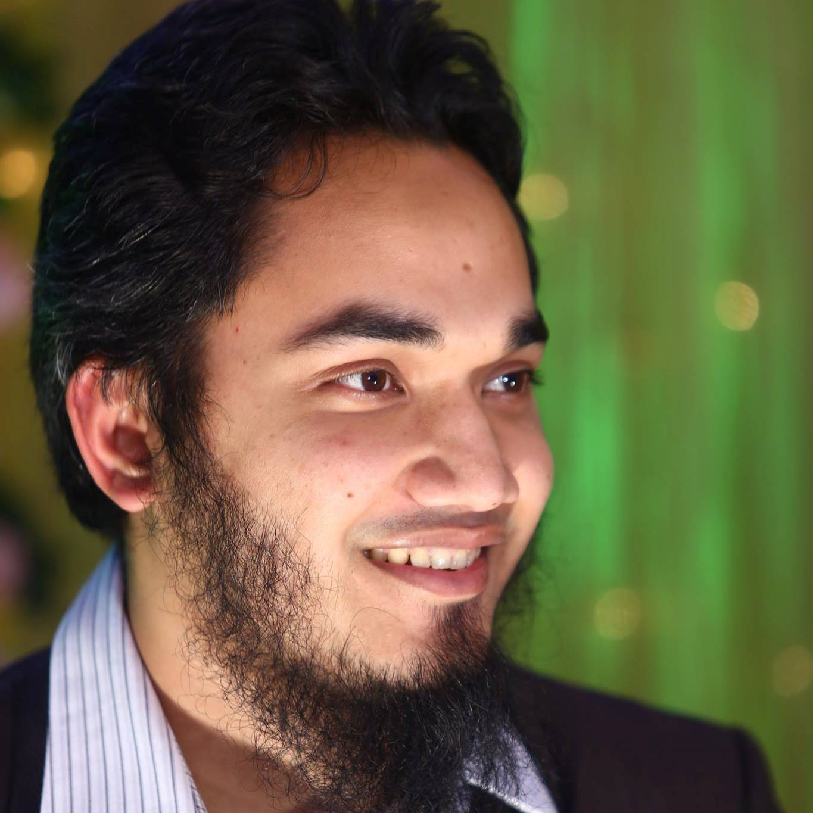

---
# Feel free to add content and custom Front Matter to this file.
# To modify the layout, see https://jekyllrb.com/docs/themes/#overriding-theme-defaults
layout: default
---

{: width="200" style="float: left; margin-right: 10px; margin-bottom: 10px"}

I am a PhD student working at [Software Maintenance and Reuse (SMR) Lab](https://sarahnadi.org/smr/), [Department of Computing Science](https://www.cs.ualberta.ca/), [University of Alberta](https://www.ualberta.ca/). I am trying to help developers overcome the challenges of switching from one library to another.

Previously I taught Software Engineering at the [Islamic University of Technology (IUT)](https://www.iutoic-dhaka.edu/).
Before that, I worked at [Streams Tech Ltd](https://www.streamstech.com.bd/) as a Software Engineer for more than 5 years.
I did my MS and BS in Software Engineering at [Institute of Information Technology](http://www.iit.du.ac.bd/), [University of Dhaka](https://www.du.ac.bd/).

I was born and raised in Bangladesh and lived most of my life in Dhaka city.  

## Research
Software Systems typically depend on libraries that evolve independently to the application.
These libraries may need to be replaced over time for many reasons.
For example, the library may go out of maintenance, or the functionalities of the current library may no longer be sufficient for the client software.
Manually replacing libraries can be time-consuming and error-prone.
My research goal is to develop tools and techniques for efficient and reliable library migration. 

## Teaching
I taught the following courses at [IUT](https://www.iutoic-dhaka.edu/). 
* SWE 4601 - Software Design and Architecture (Winter 2020)
* SWE 4501 - Design Patterns (Summer 2019)
* SWE 4401 - Software Requirements Specification (Summer 2019)
* SWE 4301 - Object Oriented Concepts II (Summer 2019)
